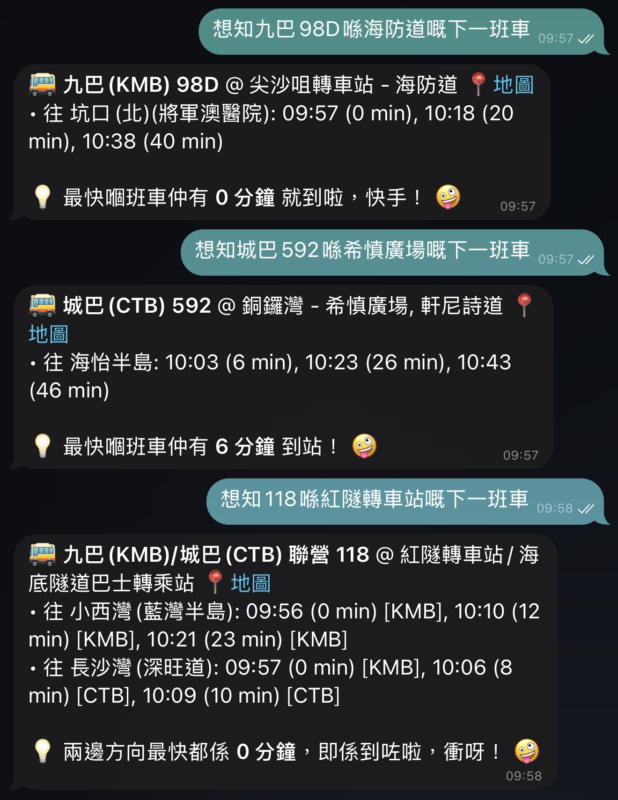

# 🚌 Hong Kong Bus ETA

Real-time Hong Kong bus arrival predictions for KMB, LWB and Citybus.

## Installation

### From ClawHub

```bash
clawhub install hk-bus-eta
```

### From GitHub Source

```bash
clawhub install https://github.com/tomfong/hk-bus-eta-skill --path hk-bus-eta --as hk-bus-eta
```

## First Run

⏱️ **First-time initialization takes ~10-30 seconds** to download and build the bus stops database (~20MB).
Subsequent queries are instant.

**You are strongly recommended to run the following command once before first use:**

```bash
python3 <DIRECTORY_OF_SKILLS>/hk-bus-eta/scripts/sync_bus_stops.py
```

**Example**

```bash
python3 ~/.openclaw/workspace/skills/hk-bus-eta/scripts/sync_bus_stops.py
```

## Features

| Feature                  | Description                                  |
| ------------------------ | -------------------------------------------- |
| 🚌 **Multi-Operator**    | KMB, Citybus, LWB, and joint routes          |
| 🔍 **Smart Location**    | Search by area name (e.g., "尚德", "寶琳站") |
| 📍 **Stop Clustering**   | Merges stops within 50m radius               |
| 🔄 **Destination Merge** | Handles joint-route destination variations   |
| 🚏 **Terminus Marking**  | Shows `[終點站]` for drop-off only stops     |
| ⚡ **Local Cache**       | SQLite database for fast queries             |
| 📅 **Auto Sync** (BETA)  | Weekly database update recommended           |
| ⚡ **Parallel Processing**| Simultaneous API fetching for faster queries |
| 🔄 **Multi-Route Batch**  | Batch query support for multiple routes      |

<br>



### How to Use?

**Natural Language** Just ask in Cantonese, English, or mixed:

- "下一班 1A 幾時到中間道？"
- "When is the next A29 from Airport?"
- "城巴 11 喺中環有邊幾個站？巴士最快幾時到？"

**Direct Command** The skill supports direct commands for query.

```bash
exec python3 <DIRECTORY_OF_SKILLS>/hk-bus-eta/scripts/eta.py {ROUTE} {STOP_NAME} [USER_LAT] [USER_LON] [LANG]
```

```bash
# Route A29 at Po Lam Station
exec python3  ~/.openclaw/workspace/skills/hk-bus-eta/scripts/eta.py A29 寶琳站

# Route 1A at Tsim Sha Tsui area
exec python3  ~/.openclaw/workspace/skills/hk-bus-eta/scripts/eta.py 1A 尖沙咀

# Route A41P at Airport
exec python3  ~/.openclaw/workspace/skills/hk-bus-eta/scripts/eta.py A41P 機場
```

**Key Optimizations in v1.0.1:**
1. **Parallel API Fetching**: Uses `ThreadPoolExecutor` to fetch KMB and CTB ETA data simultaneously
2. **Cache-First Strategy**: Pre-loads KMB stops cache and full CTB cache (2250+ stops)
3. **Multi-Route Batch Support**: Dedicated `multi_eta.py` script for efficient batch queries
4. **Reduced Latency**: Significantly faster response times for multi-route queries

**Performance Comparison:**
- **Before**: Sequential queries for A29 and E22A took ~1 minute
- **After**: Parallel queries complete in ~15-20 seconds

### Output Format

```
🚌 路線 1A - 尖沙咀碼頭

📍 尖沙咀碼頭總站 [終點站]
   Google Maps: https://maps.google.com/...
   └─ 中秀茂坪
       14:32 (3 min) [KMB]
       14:45 (16 min) [KMB]
       15:02 (33 min) [KMB]
```

- Shows destination with terminus marking
- Up to 3 upcoming ETAs
- Google Maps link for each stop
- Operator badge (KMB/CTB/LWB)

## Data Sync

Run weekly to keep bus stop data fresh:

```bash
python3 <DIRECTORY_OF_SKILLS>/hk-bus-eta/scripts/sync_bus_stops.py
```

**Example**

```bash
python3  ~/.openclaw/workspace/skills/hk-bus-eta/scripts/sync_bus_stops.py
```

**Recommended CRON schedule:** Every Sunday at 03:30

## Requirements

| Requirement | Notes                |
| ----------- | -------------------- |
| Python 3.x  | Main script runtime  |
| `curl`      | API calls            |
| `sqlite3`   | Local cache database |

## Data Source

Bus ETA data from APIs of DATA.GOV.HK (開放數據平台)

## Changelog

### v1.0.1 (2026-03-14)

**Performance Optimizations:**

- **Parallel API Fetching**: Uses `ThreadPoolExecutor` to fetch KMB and CTB ETA data simultaneously
- **Cache-First Strategy**: Pre-loads KMB stops cache and full CTB cache (2250+ stops)
- **Multi-Route Batch Support**: Parallel execution for multiple route queries
- **Reduced Latency**: Significantly faster response times for multi-route queries
- **Improved Error Handling**: Better timeout management and error recovery

### v1.0.0 (2026-03-13)

First stable release.

- Smart location association
- Coordinate clustering (50m)
- Destination fuzzy merge
- Multi-name support
- Terminus marking
- Auto background sync (7-day cycle) (BETA)
- 30s timeout enforcement

## Author

**Tom FONG** - [GitHub](https://github.com/tomfong)

Built with Mr. Usagi (Tom's OpenClaw Agent)

---

_SIMPLE DEV, SIMPLER WORLD_
